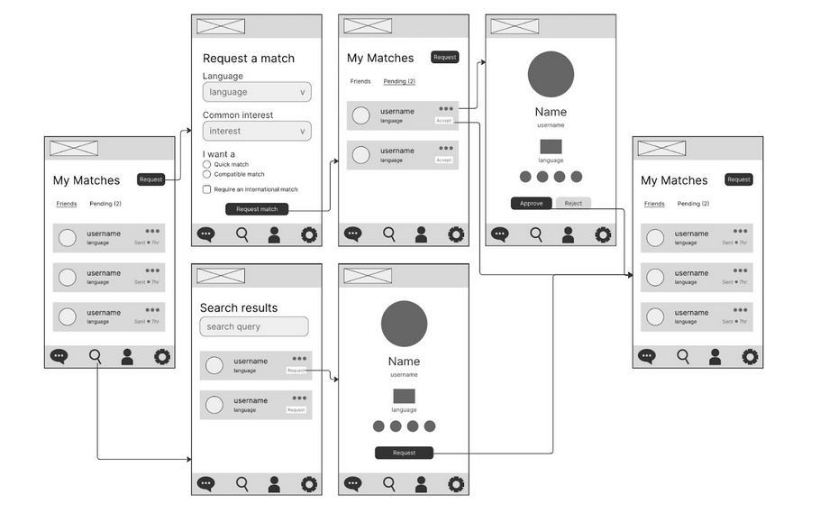
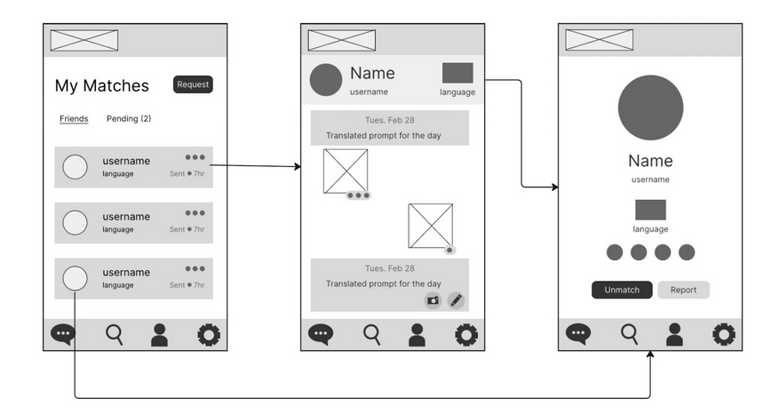
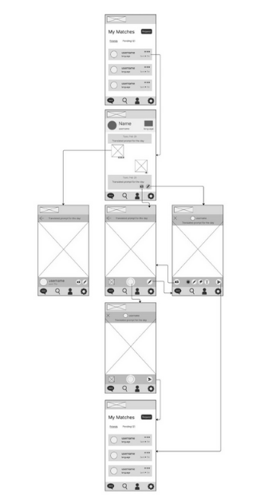

# Lenspa Project Summary

## What is Lenspa?

When thinking about their community, most people only consider the few circles closest to them: their friends, their family, their coworkers, their neighbors. While the internet has proven to be amazing for connecting to people from all around the world, existing social media platforms do little to challenge cultural and language barriers that keep people stuck in homogeneous social circles. Services rely on written or spoken communication, severely limiting the potential pool of people you can connect with. This problem is important as it contributes to a lack of cultural and world awareness that leads to racism, nationalism, prejudice, and even violence. More needs to be done to usher in an era of global connection and inclusivity.

Lenspa, is a photo based pen-pal app. Each user will be randomly matched with another user somewhere in the world based on their match preferences. Then, each day, both users would be given the same prompt in their respective languages designed to showcase different aspects of their daily experiences, culture, and realities. Both users would reply to the prompt with a picture and would be shown each other’s responses, which they could learn from and connect over.

## Low-fidelity Prototype

Our Low-fidelity prototype was created using Figma. Below are three user flows for matching with another user, unmatching with another user, and responding to a prompt with a photo or drawing:

All screens of the low-fidelity prototype can be found in our Figma file https://www.figma.com/file/i5OlYD1fbrthNZJaj7cOaY/Lenspa?node-id=0%3A1&t=Vv6UAdPZxCw8lGZ9-1.

## Working Prototype

Our working prototype is live at https://lenspa.vercel.app! The working prototype lets users sign up, match and unmatch with other users, and respond to daily prompts with images. The site is currently available in English, Russian, Chinese, and Spanish.

## Demo Video

<iframe
  width="560"
  height="315"
  src="https://www.youtube.com/embed/mQPE0wa2cG8"
  title="YouTube video player"
  frameborder="0"
  allow="accelerometer; autoplay; clipboard-write; encrypted-media; gyroscope; picture-in-picture; web-share"
  allowfullscreen
></iframe>

[Link to demo video](https://www.youtube.com/watch?v=mQPE0wa2cG8)

## Highlight of Evaluation Results

### Task 1: Requesting a Match

- Successes: 12
- Failures: 0
- Shortest Time to Complete: 6s
- Longest Time to Complete: 21s
- Average Time to Complete: 15s

### Task 2: Respond to a Prompt

- Successes: 10
- Failures: 2
- Shortest Time to Complete: 33s
- Longest Time to Complete: 2:14
- Average Time to Complete: 1:20

### Task 3: Unmatch/Report a User

- Successes: 12
- Failures: 0
- Shortest Time to Complete: 15s
- Longest Time to Complete: 42s
- Average Time to Complete: 1:20

### Concerns

- Uploading photo only works some of the time
- Variable loading times
- Uploading an existing photo needs to be more intuitive
- Reporting/unmatching with a user needs to be more intuitive
- Safety concerns about doxxing yourself, accidentally revealing more information than before
- Text in Russian is longer sometimes, doesn't always fit on buttons

### Desires

- Report individual messages
- Unblock a previously blocked match
- Force delete conversation history for the other match after unmatching (privacy issues)
- Ability to delete specific messages after sending

### Positive Feedback

- Prompt variety is good, good to not have just positive ones
- The website looks put together and modern
- Profile felt more personal than many social medias (didn't show off friends/follower counts)
- Good to have freedom and options on how to respond
- Cute idea, people seem to be excited to use it and interested in where it goes
- Really easy to match
